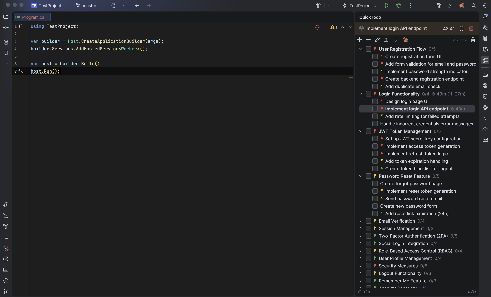
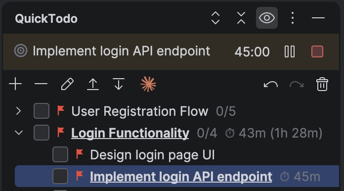
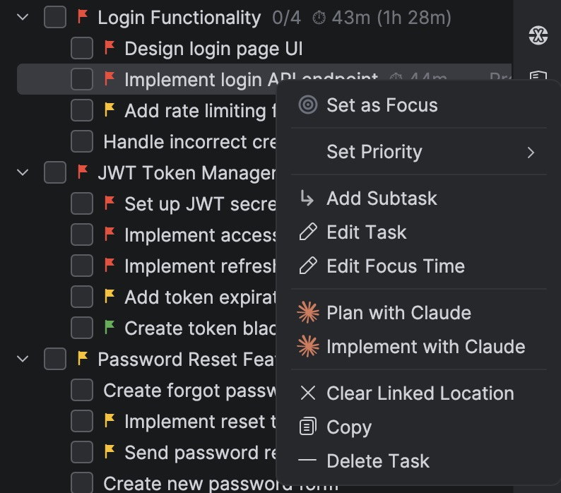
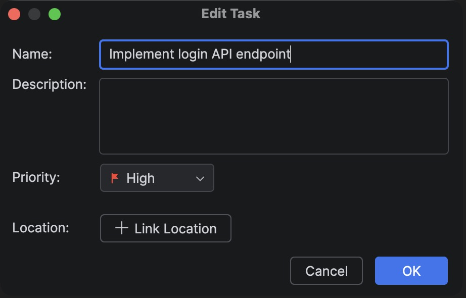
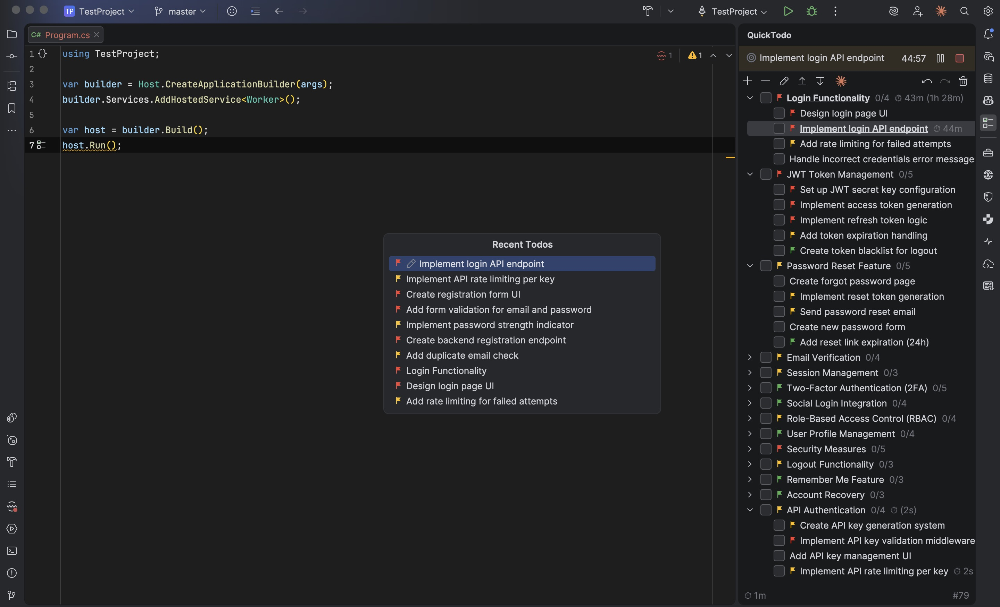
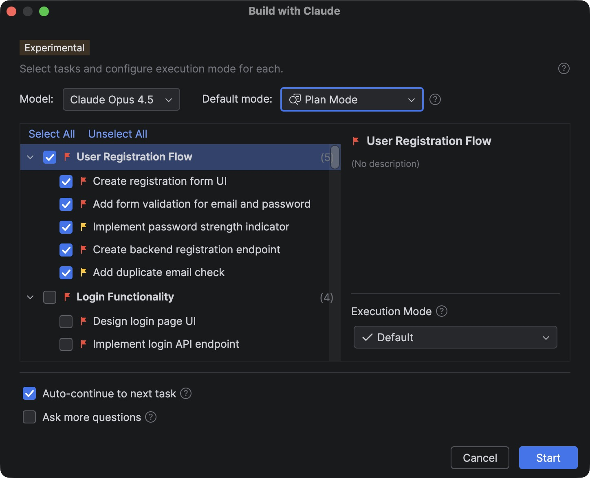

<div align="center">
  
  <h1>QuickTodo</h1>
  <p><strong>Todo list and task management without leaving your IDE</strong></p>

  <a href="https://plugins.jetbrains.com/plugin/27359-quicktodo"></a>
  <a href="https://plugins.jetbrains.com/plugin/27359-quicktodo"></a>
  
  
  <a href="LICENSE.txt"></a>
</div>

<br>

<p align="center">
  
  <br>
  <em>Hierarchical task management with priorities and focus timer</em>
</p>

<p align="center">
  
  &nbsp;&nbsp;
  
</p>
<p align="center">
  <em>Focus timer tracking &nbsp;&nbsp;&nbsp;&nbsp;&nbsp;&nbsp;&nbsp;&nbsp;&nbsp;&nbsp;&nbsp;&nbsp;&nbsp;&nbsp;&nbsp;&nbsp;&nbsp;&nbsp;&nbsp;&nbsp;&nbsp;&nbsp;&nbsp;&nbsp;&nbsp;&nbsp;&nbsp;&nbsp; Right-click context menu</em>
</p>

<p align="center">
  
  &nbsp;&nbsp;
  
</p>
<p align="center">
  <em>Edit task dialog &nbsp;&nbsp;&nbsp;&nbsp;&nbsp;&nbsp;&nbsp;&nbsp;&nbsp;&nbsp;&nbsp;&nbsp;&nbsp;&nbsp;&nbsp;&nbsp;&nbsp;&nbsp;&nbsp;&nbsp;&nbsp;&nbsp;&nbsp;&nbsp;&nbsp;&nbsp;&nbsp;&nbsp;&nbsp;&nbsp;&nbsp;&nbsp;&nbsp;&nbsp;&nbsp;&nbsp;&nbsp;&nbsp;&nbsp;&nbsp;&nbsp; Recent Todos popup</em>
</p>

<p align="center">
  
  <br>
  <em>Build with Claude - AI-powered task automation</em>
</p>

## Features

| Feature | Description |
|---------|-------------|
| **Hierarchical Tasks** | Organize work with up to 3 levels of subtasks |
| **Priority Flags** | Mark tasks as High (red), Medium (yellow), or Low (blue) priority |
| **Focus Timer** | Track time spent on tasks with auto-pause when IDE goes idle |
| **Code Linking** | Link tasks to specific code locations with gutter icons |
| **Drag & Drop** | Reorder tasks and change hierarchy with intuitive drag-and-drop |
| **Claude Code Integration** | Automate tasks with AI using Claude Code CLI |
| **Daily Statistics** | Track productivity with focus time, tasks created, and completed |
| **Undo/Redo** | Full 25-step history for all task operations |

## Installation

1. Open **Settings/Preferences** in your IDE
2. Navigate to **Plugins** → **Marketplace**
3. Search for **"QuickTodo"**
4. Click **Install** and restart the IDE

Or install directly from [JetBrains Marketplace](https://plugins.jetbrains.com/plugin/27359-quicktodo)

## Quick Start

1. **Open the tool window**: Press `Ctrl+Alt+C` (Windows/Linux) or `Cmd+Alt+C` (macOS)
2. **Add a task**: Click the `+` button or press `Ctrl+Shift+T` / `Cmd+Shift+T`
3. **Add subtasks**: Right-click a task and select "Add Subtask"
4. **Start focus timer**: Right-click a task and select "Start Focus"

> **Tip**: Right-click any task to see all available actions including priority setting, code linking, and more.

## Keyboard Shortcuts

### Global Shortcuts

Customizable in **Settings → Keymap → QuickTodo**

| Action | Windows / Linux | macOS |
|--------|-----------------|-------|
| Open QuickTodo | `Ctrl+Alt+C` | `Cmd+Alt+C` |
| Add Task (global) | `Ctrl+Shift+T` | `Cmd+Shift+T` |
| Recent Tasks | `Ctrl+F1` | `Cmd+F1` |

### In-Panel Shortcuts

Available when QuickTodo panel is focused:

| Action | Windows / Linux | macOS |
|--------|-----------------|-------|
| Add Task | `Ctrl+N` / `Ctrl+Enter` | `Cmd+N` / `Cmd+Enter` |
| Toggle Complete | `Space` | `Space` |
| Edit Task | `Enter` | `Enter` |
| Delete Task | `Delete` | `Delete` |
| Move Task Up | `Ctrl+↑` | `Cmd+↑` |
| Move Task Down | `Ctrl+↓` | `Cmd+↓` |
| Copy Task Text | `Ctrl+C` | `Cmd+C` |
| Undo | `Ctrl+Z` | `Cmd+Z` |
| Redo | `Ctrl+Shift+Z` / `Ctrl+Y` | `Cmd+Shift+Z` |
| Expand | `→` | `→` |
| Collapse | `←` | `←` |
| Clear Selection | `Esc` | `Esc` |

<details>
<summary><h2>Claude Code Integration</h2></summary>

QuickTodo integrates with [Claude Code](https://claude.com/claude-code) to help you automate coding tasks. Select multiple tasks, configure how Claude should handle each one, and let AI work through your task list.

### Prerequisites

1. Install the [Claude Code plugin](https://plugins.jetbrains.com/plugin/27310-claude-code-beta-)
2. Authenticate with your Anthropic account

### How It Works

1. **Click the Claude icon** in the QuickTodo toolbar to open the task selection dialog
2. **Select tasks** you want Claude to work on (use checkboxes in the left panel)
3. **Configure each task** by clicking on it in the right panel to set execution mode
4. **Click Start** - Claude processes tasks one by one in the terminal

#### What Claude Receives

For each task, QuickTodo builds a rich prompt that includes:

- **Project context**: Project name and working directory
- **Task details**: Title, priority level, and description
- **Code context**: If the task is linked to a code location, Claude receives the relevant code snippet (up to 30 lines around the linked line)
- **Subtasks**: Any subtasks are included as a checklist
- **Session history**: Previously completed tasks in the session for context continuity

#### Task Processing

- Tasks are processed **sequentially** - Claude completes one task before moving to the next
- When Claude finishes a task, QuickTodo automatically **marks it as completed**
- With **Auto-continue** enabled, the next task starts automatically
- Without Auto-continue, you'll see a confirmation dialog between tasks

### Execution Modes

Each task can have its own execution mode:

| Mode | Description | Best For |
|------|-------------|----------|
| **Plan Mode** | Interactive review - approve each change before applying | Complex changes, learning how Claude works |
| **Accept Edits** | Auto-accepts file operations (Edit, Write, Read, Glob, Grep) | Routine tasks, trusted changes |
| **Skip Permissions** | No permission prompts (use with caution) | Quick fixes, when you fully trust the output |

> **Tip**: Set a default mode for all tasks, then override individual tasks that need different handling.

### Model Selection

| Model | Strengths |
|-------|-----------|
| **Claude Opus 4.5** | Most capable, best for complex architectural tasks |
| **Claude Sonnet 4** | Faster and more cost-effective for routine tasks |

### Additional Options

- **Auto-continue**: Automatically proceed to next task after completion (no confirmation needed)
- **Ask more questions**: Instructs Claude to ask clarifying questions before implementing

### Workflow Controls

While Claude is working, use the toolbar buttons to:

- **Pause**: Temporarily halt processing (resume later)
- **Resume**: Continue from where you paused
- **Stop**: End the session completely

</details>

## Configuration

Open **Settings → Tools → QuickTodo** to configure:

| Setting | Description |
|---------|-------------|
| **Tooltip Behavior** | Show on hover / Truncate long text / Full text |
| **Auto-pause Timer** | Pause focus timer when IDE goes idle |
| **Idle Timeout** | Time before auto-pause (1-60 minutes) |
| **Hierarchy Time** | Accumulate subtask time in parent tasks |
| **Task Position** | Add new tasks at top or bottom of list |
| **Recent Tasks** | Number of recent tasks to display (5-50) |

### Data Storage

Tasks are stored per-project in:
- **Task list**: `.idea/quicktodo.tasklist.xml`
- **AI config**: `.idea/quicktodo.ai.xml`

## Building from Source

### Requirements

- IntelliJ IDEA 2025.1+
- JDK 21

### Commands

```bash
# Build the plugin
./gradlew build

# Run IDE with plugin for testing
./gradlew runIde

# Verify plugin compatibility and check for deprecated API usage
./gradlew verifyPlugin
```

## Contributing

Contributions are welcome! Please feel free to submit issues and pull requests.

1. Fork the repository
2. Create your feature branch
3. Run `./gradlew build` to ensure everything compiles
4. Run `./gradlew verifyPlugin` to check for deprecated API usage
5. Submit a pull request

## Support

- **Bug reports**: [Report a bug](../../issues/new?template=bug_report.md)
- **Feature requests**: [Request a feature](../../issues/new?template=feature_request.md)
- **Questions**: [Ask a question](../../issues/new?template=question.md)

## Changelog

See [CHANGELOG.md](CHANGELOG.md) for a detailed list of changes in each version.

## License

This project is licensed under the Apache License 2.0 with Commons Clause. See [LICENSE.txt](LICENSE.txt) for details.

---

<div align="center">
  Made with ❤️ for JetBrains IDEs
</div>
